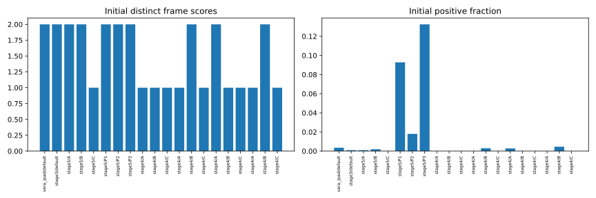
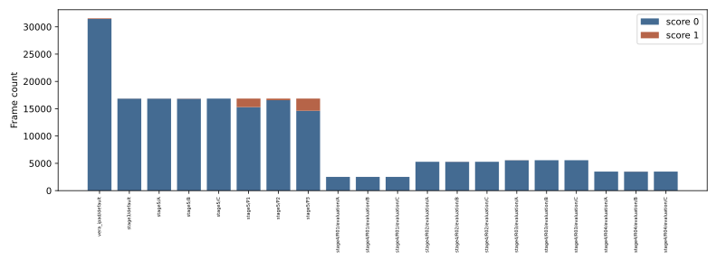

# 8단계 Step 0 — 점수·후처리 진단

기존 37영상·16,862프레임의 탐색적 진단입니다. 미관측 hold-out은 없으며 확증 평가는 보류합니다.

| 조건 | 초기 AUROC / AP (%) | 최종 AUROC / AP (%) | 최종 Δ vs ONE (pp) |
|---|---:|---:|---:|
| ONE | 50.0000 / 20.2049 | 58.9537 / 24.9036 | 0.0000 / 0.0000 |
| ORACLE | 99.5678 / 95.8687 | 99.7873 / 98.3261 | 40.8336 / 73.4225 |
| RANDOM | 46.9151 / 20.5535 | 52.7024 / 23.4087 | -6.2512 / -1.4948 |
| ZERO | 50.0000 / 20.2049 | 50.0000 / 20.2049 | -8.9537 / -4.6986 |

ORACLE은 각 점수 블록의 정답 최대값을 주입한 진단용 대조군이며 모델 결과나 이론적 상한이 아닙니다.
ORACLE 최종 macro AUROC=99.7873%; 90 미만이면 시간 창/후처리 진단을 우선 수행합니다.
기존 DINOv2 무조건부 NN: 동일 프레임 교집합 5986개, macro AUROC 89.6330%, AP 87.6294%. 37영상 전체 기준선으로 표현하지 않습니다.
DINOv2 원 메모리는 원래 정상 training 전체를 사용했습니다. 재분할 validation/evaluation에 쓸 하이브리드는 해당 영상들을 제외한 메모리를 새로 학습해야 합니다.
초기 점수 1종이면 순위 소실이 확정됩니다. 2종이고 AUROC=50이라는 사실만으로 원인이 확정되지는 않습니다.
ONE은 위치 prior 대조군입니다. 최초 점수의 우연 AUROC 기준은 여전히 50%입니다.
원본 컨테이너가 없어 실제 FPS는 검증할 수 없습니다. 30 FPS 가정을 유지하며 JPEG를 영상으로 만들어 측정값처럼 사용하지 않습니다.
학습·추론 없음. 원시 점수, 지표, 입력 SHA는 experiments/stage8/step0에 보존합니다.

영상 단위 paired bootstrap 2,000회 결과:

- ORACLE−ONE: 초기 AUROC CI [49.05168591236924, 49.77582250437146], 최종 [31.62822113554842, 47.3593119993596]; 무효 441/2000.
- RANDOM−ONE: 초기 AUROC CI [-6.493205369503133, 0.915099356796878], 최종 [-13.00524120283862, 2.920707004978223]; 무효 441/2000.
- ZERO−ONE: 초기 AUROC CI [0.0, 0.0], 최종 [-18.24771884582868, -2.3801754428735045]; 무효 441/2000.

